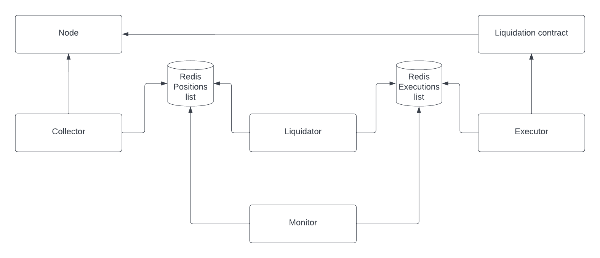

# Multichain liquidator bot

The multichain liquidator bot is a scalable liquidation bot that ensures accounts
are liquidated in a timely fashion.

It is built to support both the [RedBank](https://github.com/mars-protocol/red-bank) and [Rover](https://github.com/mars-protocol/rover).

NOTE: For questions, issues or support, feel free to join the `liquidators` channel in the mars discord

The bot is composed of 4 distinct parts. As an overview of the architecture, please refer to this image. Each part is explained in more detail below.




1. Collector

The Collector service is responsible for fetching all the user addresses that
have debts in the Mars Red Bank and passes them on to the Health Checker. More info in [collector](./collector/README.md)

2. Health Checker

Health Checker is responsible for fetching the health status for positions, 
and flagging unhealthy positions for liquidation. More info in [health-checker](./health-checker/README.md)

3. Liquidator

The Liquidator service is responsible for handling liquidations of unhealthy positions. There are liquidation services (called `executors`) for both Redbank and rover (wip). More info in [liquidator](./liquidator/README.md).

4. Manager

The Manager service is responsible for ensuring all the data is processed within
a timeframe. By default, the timeframe is a single block. It is also responsible for booting up new services (i.e health checker, executor) to meet demand. More info in [manager/README](manager)

## Usage

Each service contains utilities to build and run the code in a uniform manner by
way of Makefiles. Each Makefile contains a help that can be executed via 
`make help`.

The top-level Makefile contains helpers to build and run all the services and 
contains the same `make help`.

```shell
# Help
make help

# Build all services
make

# Build Docker images and start manager
make run

# Build all Docker images
make docker_build
```


## Deploying

### Docker

Before starting, ensure your user can run Docker commands without `sudo`. If 
you can't, refer to [DigitalOcean's guide (Step 2)](https://www.digitalocean.com/community/tutorials/how-to-install-and-use-docker-on-ubuntu-22-04)

For Docker we assume you're using the local registry built into Docker. You can
see all your existing images by using `docker images`

We provide convenience Makefiles for each service to ease compiling and building 
Docker containers. To build all the Docker images, use the top-level Makefile
by running `make docker_build` in the project root. This will compile the 
service and build the Docker images locally for each service.

Once the images are available for the collector, health checker and executor
you may change the config in the manager's Makefile located at `./manager/Makefile`. 
You'll need to tweak the settings for the RPC, Hive and websocket endpoints as well
as COLLECTOR_CONFIG, EXECUTOR_CONFIG and HEALTH_CHECKER_CONFIG to match your setup.

When you're ready to start the service, do `make run_manager` from the project
root. This will start the manager service and it will deploy the other services
as needed.


### AWS using Elastic Container Service (ECS)

The guide below does not provide the optimal security setup for the cluster, 
we recommend implementing your security parameters.

__Set up container registry__

You'll need the Docker images to be available to ECS by either pushing to a 
public registry or a private registry. You can learn more about setting up
and AWS container registry by visiting [the AWS ECR docs](https://aws.amazon.com/ecr/)

Add a repository for each service, and modify the `IMAGE_NAME` in each service's Makefile
to point to your own repositories.

You'll need repositories for the following services:

1. multichain-manager
2. multichain-collector
3. multichain-health-checker
4. multichain-liquidator

__Push images to container registry__

We provide convenience Makefiles for each service to ease compiling and building 
Docker containers. To build all the Docker images, use the top-level Makefile
by running `make docker_push` in the project root. This will compile the service,
build and push the Docker images to the remote repositories for each service.

> Note: You'll need to use the AWS and Docker CLI to log in to your AWS account. You can
> learn more in [the AWS docs](https://docs.aws.amazon.com/AmazonECR/latest/userguide/getting-started-cli.html)
>
> The command will look something like `aws ecr --region <your-region> get-login-password --profile <your-profile> | docker login --username AWS --password-stdin <your-ecr-registry-address>`

__Create an AWS ECS cluster__

You'll need to create a Fargate compatible cluster, known as a 'Networking only' cluster. More
can be found at the [documentation for ECS](https://aws.amazon.com/ecs/).


__Set up Redis__

We use Redis as a queue and cache for the service, you'll need to deploy a
small [ElastiCache cluster](https://aws.amazon.com/elasticache/)

You'll need to ensure:

1. It's a Redis cluster
2. Engine version: 6.2 or higher
3. Node type: cache.t4g.micro is sufficient

__Create and start the manager task__

The manager service is responsible for deploying the other services, however, it
can't deploy itself. Thus, the task and service for the manager is the only one
that needs to be created manually or via a tool such as 
[CloudFormation](https://aws.amazon.com/cloudformation/) or 
[HashiCorp's Terraform](https://www.terraform.io/)

1. Create the task definition
    - Select Fargate
    - Operating system family: Linux
    - Task memory: 1GB
    - Task CPU: 0.5vCPU

    - Add container
        - Soft memory limit: 256
        - No port mappings
        - Healthcheck: Not required
        - Environment variables: Set all variables specified in Makefile

            _Take special note of all the endpoints and be sure to use the Redis you configured earlier as well as the AWS keys you need to create and provide_
        - Start timeout: 30
        - Stop timeout: 30
        - Auto-configure CloudWatch Logs: Checked

2. Create service from task definition

    - Launch type: Fargate
    - Operating system family: Linux
    - Task definition: multichain-manager with the latest revision
    - Number of tasks: 1 (A single instance of the manager can manage tens of thousands of debt positions)
    - Minimum healthy percent: 100
    - Maximum percent: 200
    - Deployment circuit breaker: Disabled
    - Deployment type: Rolling update
    - Enable ECS managed tags: Checked
    - Auto-assign public IP: Enabled (disabling this will block the pulling of the container)
    - Service auto scaling: Do not adjust the service's desired count

3. Note: You'll need to provide the manager with a role ARN. You can create this manually or let AWS create it for you the first time that you create the manager definition. Once you created the definition for the manager you can find the role ARN under Task definition -> JSON. This needs to be added to the definition itself.

If everything was configured correctly your service should start. You can open the Manager's logs in CloudWatch -> Log Groups to see what it's doing. The manager will deploy the other services as needed and they don't
need to be managed manually.

