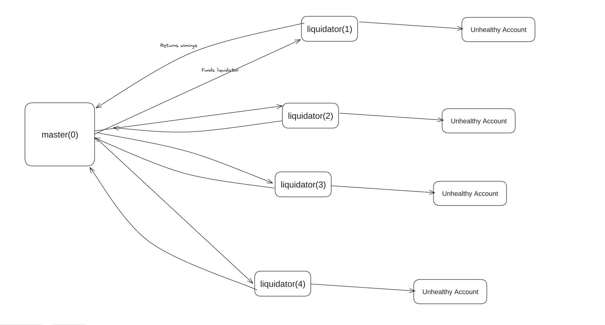

## Mars V2 Liquidator
Liquidator reads unhealthy positions from the mars api.

Endpoints:
- [Redbank](https://api.marsprotocol.io/v1/unhealthy_positions/osmosis/redbank)
- [Rover](https://api.marsprotocol.io/v1/unhealthy_positions/osmosis/creditmanager) 

Note that this liquidator supports v2 redbank and v2 credit manager, but not V1.

## Redbank

Redbank liquidator submits two transactions:

- The first transaction is an optional message to aquire debt via swapping its stablecoins (if required), and the second msg (or first if swap to debt not required) is to liquidate. 
- After successfull first transaction, the liquidator will withdraw all collateral in rebank (i.e winnings), and swap these back to the neutral asset.

## Rover

Rover executor service differs from the redbank in a few ways.

The rover liquidator operates atomically, borrowing the required debt and using that to liquidate, before swapping the winnings back to stables. At the end of every transaction, the liquidator will `refund_all_balances` so that the next liquidation will start from a clean slate.

### Rover Architecture

To support multiple liquidations per block, we use a master account with worker addresses that independently take care of liquidating a given position. All these addresses operate under the same mnemonic, but will use a different index for each of the different worker addresses. The master account is address 0, and all others number off from 1..n, where n is the max liquidators configured.

These workers are funded with gas money by the master account, and periodically return the winnings to the master account.



### Instructions
1. Clone this repo
```shell
https://github.com/mars-protocol/multichain-liquidator-bot.git
git checkout mars-v2
```
2. Install dependencies
```shell
yarn install
```
3. Set environment variables

- Credit manager:

```shell
cp .osmosis.rover.env .env
```

- Redbank:

```shell
cp .osmosis.redbank.env .env
```
4. Run liquidator
```shell
yarn start
```

### Common errors

There are a few errors that sometimes prevent us from liquidating, for various reasons.
- `Coin amount was zero` - this error occurs because one of the assets we have tried to swap to has reached 100% of the deposit cap.
- `Cosmwasm pool not supported` - (Osmosis) We currently do not support cosmwasm pools on osmosis via the swapper, but the sqs router will give us back routes with cosmwasm pools in it. Generally, liquidity conditions change frequently and the optimal route will be different later, at which time the liquidation will succeed if there are no cosmwasm pools in the route.
- `Amount recieved was less than n` - This is a liquidity / slippage issue. Should not occur under normal circumstances but can if there is an issue with routing or a really large position.
